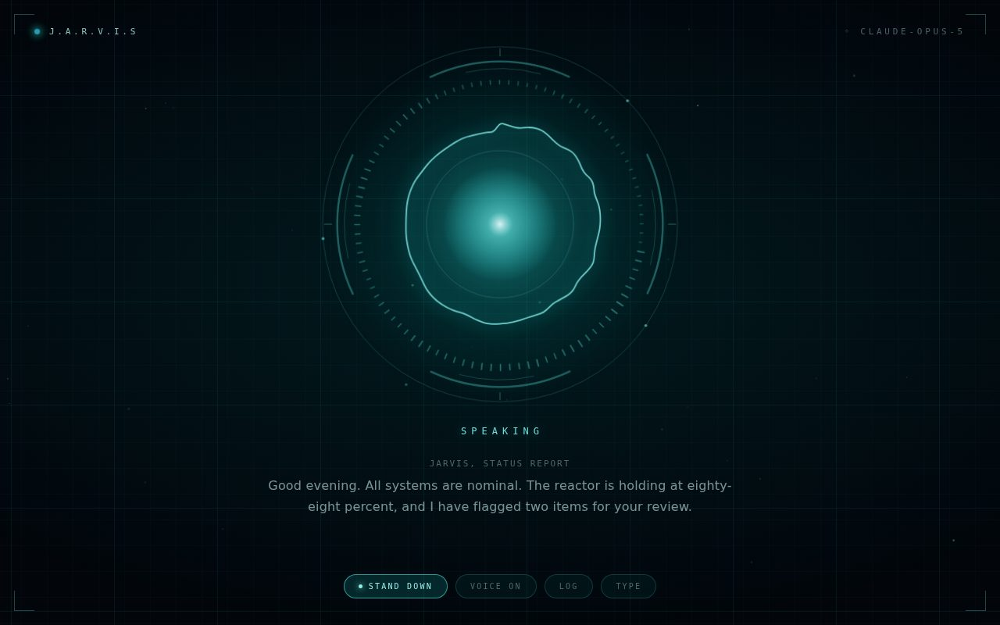

# D2L Brightspace MCP Server

An [MCP](https://modelcontextprotocol.io) server that connects Claude directly to your
D2L Brightspace account, exposing your **courses**, **assignments**, **grades**, and
**announcements** through Brightspace's Valence Learning Framework API.

> This repository also contains **[JARVIS](#jarvis-voice-interface)**, a browser-based
> voice assistant with a heads-up-display interface. It is a separate application from
> the MCP server and shares nothing with it but the repo. See below.

## Tools

| Tool                     | Description                                                                      |
| ------------------------ | --------------------------------------------------------------------------------- |
| `list_courses`           | Lists your course enrollments (name, code, org unit ID, dates, role).             |
| `list_assignments`       | Lists dropbox/assignment folders for a course. Takes `orgUnitId`.                |
| `list_grades`            | Lists your grade values for a course. Takes `orgUnitId`.                         |
| `list_announcements`     | Lists announcements (news items) for a course. Takes `orgUnitId`.                |
| `list_quizzes`           | Lists quizzes for a course. Takes `orgUnitId`.                                   |
| `list_content`           | Lists a course's table of contents, including publisher links. Takes `orgUnitId`. |
| `list_connect_assignments` | Lists McGraw-Hill Connect coursework. Needs a captured Connect session. |
| `list_discussion_topics` | Lists discussion topics (across all forums) for a course. Takes `orgUnitId`.     |
| `list_discussion_posts`  | Lists posts within one discussion topic. Takes `orgUnitId` and `topicId`.        |

Note: `list_assignments` only covers Brightspace's native Dropbox folders. Coursework hosted on
a third-party publisher platform (McGraw-Hill Connect, Pearson MyLab, WileyPLUS, Cengage) is not
a dropbox, so it never appears there.

`list_content` is how that work becomes visible. The launch link for publisher coursework almost
always sits in the course's table of contents, carrying the due date the instructor set, and
topics that leave Brightspace are flagged `isExternal`. What this **cannot** do is read the
publisher's own system: your score, completion state, and any due date set inside Connect or
MyLab rather than in Brightspace live on that company's servers, behind a separate login and
with no public API. If an instructor never linked the work in Brightspace, nothing here will
find it.

`orgUnitId` comes from the `list_courses` result — ask Claude to list your courses first,
then query assignments/grades/announcements for whichever course you're interested in.

## Authentication

This server supports three ways to authenticate, in order of preference:

- **OAuth 2.0** (Option A) — the officially supported, recommended method.
- **Legacy Valence ID/Key** (Option B) — an older fallback for instances without OAuth.
- **Session cookie replay** (Option C) — a workaround for when your institution won't issue
  either of the above to individual users at all (common for students).

Options A and B both require an admin-registered API application. If you don't have access
to Brightspace's "Admin Tools > API Management" and can't get IT to register one for you,
skip to **Option C**.

### Option A: OAuth 2.0 (recommended)

1. Ask your Brightspace administrator to register an OAuth 2.0 application for you under
   **Admin Tools > API Management > OAuth 2.0**, or do it yourself if you have access. Set:
   - **Redirect URI**: `http://localhost:8918/callback` (or your own, if you customize
     `BRIGHTSPACE_OAUTH_REDIRECT_URI`)
   - **Scope**: grant at least the scopes this server requests by default (see
     `.env.example`'s `BRIGHTSPACE_OAUTH_SCOPE`), or narrow it to just what you need.
   - Note the generated **Client Id** and **Client Secret**.
2. Copy `.env.example` to `.env` and fill in:
   ```
   BRIGHTSPACE_DOMAIN=yourschool.brightspace.com
   BRIGHTSPACE_AUTH_METHOD=oauth
   BRIGHTSPACE_CLIENT_ID=...
   BRIGHTSPACE_CLIENT_SECRET=...
   ```
3. Run the one-time authorization flow to get a refresh token:
   ```
   npm install
   npm run auth:oauth
   ```
   This opens a local callback server, prints a Brightspace login URL for you to open in a
   browser, and on approval exchanges the authorization code for a refresh token. Copy the
   printed `BRIGHTSPACE_REFRESH_TOKEN` value into `.env`.

   The server automatically refreshes the access token as needed using this refresh token,
   so you shouldn't need to repeat this step unless the refresh token is revoked. If
   Brightspace rotates the refresh token during use, the server logs the new value to
   stderr — update `.env` if that happens.

### Option B: Legacy Valence ID/Key

This is D2L's original (pre-OAuth) Valence authentication scheme: your registered API
Application has an App Id/App Key, and each authorizing user gets a User Id/User Key,
combined via HMAC-SHA256 request signing.

1. Register an "API Application" in Brightspace (Admin Tools > API Management) to get an
   **App Id** and **App Key**.
2. Copy `.env.example` to `.env` and fill in:
   ```
   BRIGHTSPACE_DOMAIN=yourschool.brightspace.com
   BRIGHTSPACE_AUTH_METHOD=apikey
   BRIGHTSPACE_APP_ID=...
   BRIGHTSPACE_APP_KEY=...
   ```
3. Run the helper script to obtain your personal User Id/User Key:
   ```
   npm install
   npm run auth:apikey
   ```
   Open the printed URL, log in to Brightspace, and the script prints the raw callback
   parameters Brightspace sends back. **Field names for the user id/key vary by
   Brightspace version** — the script prints the full raw response so you can match it
   against your instance's documentation rather than guessing. Put the resulting values in
   `.env` as `BRIGHTSPACE_USER_ID` / `BRIGHTSPACE_USER_KEY`.

   If this doesn't work on your instance, use Option A (OAuth) instead — it's the modern,
   fully standardized path.

### Option C: Session cookie workaround (no admin access needed)

Many institutions (especially for student accounts) don't expose API application
registration to anyone but IT/LMS admins. If that's you, this option authenticates by
reusing your own logged-in browser session instead of an API credential — no admin
involvement required.

**Read this before using it:**
- Your **password is never seen or stored** by this tool. Only the resulting session
  cookies are saved locally, and only after you log in yourself in a real browser window.
- This calls Brightspace's own internal JSON API endpoints (the same ones its web UI uses)
  authenticated as your browser session, rather than through a sanctioned API credential.
  Automated access like this is commonly against an institution's acceptable-use policy for
  their LMS, even when it's your own data — use your judgment about your school's rules.
- Sessions expire (typically hours to a couple of weeks, depending on your school's
  settings), so you'll periodically need to redo the one-time login below.
- If your school ever tightens security around the API endpoints this depends on, this
  method can stop working with no warning; Options A/B are more durable when available.

Setup:

1. Copy `.env.example` to `.env` and fill in:
   ```
   BRIGHTSPACE_DOMAIN=d2l.yourschool.edu
   BRIGHTSPACE_AUTH_METHOD=session
   ```
2. Install dependencies and the Playwright browser binary it needs:
   ```
   npm install
   npx playwright install chromium
   ```
3. Log in interactively:
   ```
   npm run auth:session
   ```
   A real Chromium window opens to your Brightspace login page. Log in exactly as you
   normally would, including any two-factor/SSO step your school requires. It watches for
   Brightspace's own session cookie rather than for a particular URL, so campus SSO portals,
   redirects, and new tabs are all fine — it saves as soon as you are actually signed in,
   wherever you happen to land. The session goes to `.auth/storageState.json` (already
   gitignored — never commit this file) and the browser closes itself.

   If it somehow doesn't notice, press **Enter** in the terminal to save anyway. That still
   refuses if no session cookie is present, so it can't write a file that wouldn't work.
   It waits up to ten minutes.
4. Whenever a tool call fails with a message about an expired session, just re-run
   `npm run auth:session`.

## Running the server

```
npm install
npm run build
npm start
```

Or for local development without a build step: `npm run dev`.

## Connecting to Claude

Add this server to your Claude Desktop config
(`~/Library/Application Support/Claude/claude_desktop_config.json` on macOS,
`%APPDATA%\Claude\claude_desktop_config.json` on Windows):

```json
{
  "mcpServers": {
    "d2l-brightspace": {
      "command": "node",
      "args": ["/absolute/path/to/D2L-connector/dist/src/index.js"],
      "env": {
        "BRIGHTSPACE_DOMAIN": "yourschool.brightspace.com",
        "BRIGHTSPACE_AUTH_METHOD": "oauth",
        "BRIGHTSPACE_CLIENT_ID": "...",
        "BRIGHTSPACE_CLIENT_SECRET": "...",
        "BRIGHTSPACE_REFRESH_TOKEN": "..."
      }
    }
  }
}
```

(You can omit the `env` block and rely on a `.env` file in the project directory instead —
the server loads it automatically via `dotenv`.)

Restart Claude Desktop, then ask things like "What courses am I enrolled in?" or "What
assignments are due in [course]?" — Claude will call `list_courses` first to find the
course's org unit ID, then the relevant follow-up tool.

## How it works

- **API version discovery**: the server calls Brightspace's public `/d2l/api/versions/`
  endpoint on first use to discover the latest supported API version for each product
  (`lp` = Learning Platform, `le` = Learning Environment), rather than hardcoding a version
  that might not match your instance. Override with `BRIGHTSPACE_LP_VERSION` /
  `BRIGHTSPACE_LE_VERSION` if needed.
- **Pagination**: list endpoints that use Brightspace's bookmark-based paging are followed
  automatically (capped at 500 items).
- **Data mapped**:
  - Courses: `GET /d2l/api/lp/{version}/enrollments/myenrollments/?orgUnitTypeId=3`
  - Assignments: `GET /d2l/api/le/{version}/{orgUnitId}/dropbox/folders/`
  - Grades: `GET /d2l/api/le/{version}/{orgUnitId}/grades/` +
    `GET /d2l/api/le/{version}/{orgUnitId}/grades/values/myGradeValues/`
  - Announcements: `GET /d2l/api/le/{version}/{orgUnitId}/news/`
  - Quizzes: `GET /d2l/api/le/{version}/{orgUnitId}/quizzes/`
  - Discussion topics: `GET /d2l/api/le/{version}/{orgUnitId}/discussions/forums/` +
    `GET /d2l/api/le/{version}/{orgUnitId}/discussions/forums/{forumId}/topics/` per forum
  - Discussion posts: `GET /d2l/api/le/{version}/{orgUnitId}/discussions/topics/{topicId}/posts/`

## Security notes

- Credentials (client secret, refresh token, app/user keys, or session cookies) are read
  from environment variables / local files and never logged. Keep `.env` and `.auth/` out of
  version control (both are already in `.gitignore`).
- This server only performs read (`GET`) requests — it cannot modify grades, submit
  assignments, or post announcements.
- The session cookie method (Option C) grants whoever holds `.auth/storageState.json` full
  access to your Brightspace account for the life of that session — treat that file like a
  password and never share or commit it.


---

# JARVIS voice interface

A browser-based, voice-driven assistant with an Iron Man style holographic interface.
You speak, Claude answers, and it speaks back — no typing, no chat log to scroll.



## What it is

- **Real-time voice in and out.** The browser transcribes your speech, streams it to
  Claude, and speaks the reply back. Speech starts on the first complete sentence rather
  than waiting for the whole response, so replies begin almost immediately.
- **Hands-free conversation.** Once engaged it loops: listen, answer, listen again. Tap
  the core (or press Space) while it's talking to interrupt and take the floor back.
- **A visualizer that reacts to real audio.** While listening, the ring is driven by an
  FFT of your actual microphone input. While speaking, it's driven by the synthesizer's
  word-boundary events, so the pulse tracks the rhythm of the speech.
- **Text stays secondary.** The last exchange appears under the visualizer in low
  contrast; the full transcript lives in a panel you open deliberately.
- **Wake word.** Optional. Say "Jarvis" and it wakes; say "Jarvis, what's the
  weather" and it wakes and answers in one breath, without touching anything.
- **Web search.** Optional. It can look things up rather than answering from
  memory alone; the status reads "Searching" while it does.
- **It remembers.** Conversations survive closing the tab. Stored in your browser
  only, and cleared with one button.
- **Everything is yours to change.** A settings panel covers the name, accent
  colour, personality, voice, speaking rate, and model — no file editing.
- **It knows your courses.** If Brightspace is configured (above), you can ask
  "what's due this week?" out loud and get a real answer — including homework
  hosted on a textbook publisher's platform, where the course links out to it.

## Running it

```bash
npm install
echo "ANTHROPIC_API_KEY=sk-ant-..." >> .env    # see .env.example
npm run jarvis
```

Then open <http://127.0.0.1:8917> and click the core.

`npm run jarvis` runs the TypeScript directly via tsx. For a compiled build use
`npm run build && npm run jarvis:start`.

## Controls

| Action | Control |
| --- | --- |
| Engage / stand down | Click the core, or <kbd>Space</kbd> |
| Interrupt a reply and speak | Click the core, or <kbd>Space</kbd>, while it's talking |
| Mute the voice (text only) | <kbd>M</kbd>, or the **Voice** button |
| Open the transcript | <kbd>L</kbd>, or the **Log** button |
| Type instead of speaking | <kbd>/</kbd>, or the **Type** button |
| Open settings | <kbd>S</kbd>, or the **Settings** button |
| Stand down / close panels | <kbd>Esc</kbd> |

## Browser support

Voice **input** uses the Web Speech API's `SpeechRecognition`, which today means Chrome,
Edge, or Safari — Firefox has no implementation. The interface detects this and falls
back to the text input, so everything except the microphone still works there. Voice
**output** (`speechSynthesis`) is supported everywhere.

The assistant's voice is whichever system voice best matches a British English preference
list; the exact voice depends on what your OS and browser ship.

## How it's put together

The front end is plain ES modules with no build step and no framework — the whole thing
is served as static files.

| File | Responsibility |
| --- | --- |
| `web/server/index.ts` | Static host, plus `POST /api/chat` streaming relay to Claude |
| `web/public/js/app.js` | The turn state machine, and everything wired together |
| `web/public/js/signal.js` | Shared animation state both canvases read from |
| `web/public/js/audio.js` | Microphone FFT, log-mapped to the visualizer's bands |
| `web/public/js/visualizer.js` | The reactor: rings, ticks, radial waveform |
| `web/public/js/ambient.js` | Drifting grid layers and light motes |
| `web/public/js/voice.js` | Speech recognition, wake-word matching, sentence-chunked synthesis |
| `web/public/js/settings.js` | Persisted preferences and the persona presets |
| `web/public/js/memory.js` | Conversation history across sessions |
| `web/public/js/claude.js` | SSE client for the backend |

**The API key never reaches the browser.** The page talks only to the local server, which
holds the key and streams Claude's response back over SSE. The server binds to
`127.0.0.1` by default for the same reason: it has no authentication of its own, so it
shouldn't be reachable from the network. Set `JARVIS_HOST=0.0.0.0` only if you understand
that anyone who can reach the port can spend your API credits.

Conversation state lives entirely in the browser and is sent with each request, so the
server is stateless and restarting it mid-conversation loses nothing. History is capped
at the last 30 turns to bound cost and latency.

## Course access

If the Brightspace credentials at the top of this README are configured, the
voice interface gains four tools and a **Course access** toggle in settings.
Ask "what's due this week", "how am I doing in chemistry", or "any
announcements" and it looks the answer up before replying.

Nothing extra is needed beyond a working `.env` — the server detects
`BRIGHTSPACE_DOMAIN` at startup, and the toggle only appears when the lookup is
actually available. Without it the voice interface runs exactly as before.

These tools wrap the same functions the MCP server uses (`src/tools/`), but
reshape them for speech. The MCP tools take an `orgUnitId`, which would force
two round trips — list the courses, then ask again — before anything could be
said out loud. `web/server/courses.ts` takes a course *name* instead, resolves
it server-side, fans out across courses in parallel, and strips assignment
instructions and announcement HTML that would otherwise be latency the listener
sits through.

| Tool | Answers |
| --- | --- |
| `list_courses` | "What classes am I taking?" |
| `get_coursework` | "What's due this week?" — assignments, quizzes, and publisher homework, soonest first |
| `get_grades` | "How am I doing in chemistry?" |
| `get_announcements` | "Anything new posted?" |

An ambiguous course name comes back as a list of candidates rather than a
guess, so it asks which one you meant. A single course failing to load doesn't
sink the whole answer.

## Publisher platforms (McGraw-Hill Connect and similar)

Some instructors put every assignment in Connect, MyLab or WileyPLUS and link
nothing in Brightspace. When that happens there is nothing on the Brightspace
side to read, and `get_coursework` will correctly report that the course has
no upcoming work — the work exists, just not anywhere this can see.

Reading the publisher directly is a different proposition, and worth being
clear-eyed about:

- **There is no public API.** Connect is read by replaying a logged-in browser
  session, the same workaround used for Brightspace above.
- **It breaks.** The publisher can change their site at any time, and nothing
  here is a supported integration.
- **It is likely against the publisher's terms of use.** This is your own
  coursework and the access is read-only, but that is the situation.
- **It cannot be written blind.** Connect's endpoints are undocumented, so a
  parser has to be written against a real capture from a real account.

`npm run connect:capture` sets this up. It opens a browser, you log into
Brightspace and click through to Connect exactly as you normally would
(institutions that use LTI launch have no separate Connect password, which is
why this starts at Brightspace), and it records the JSON that Connect's own web
app fetches while you browse to your assignments. It saves the session and
notes which page triggered the assignment fetch, so later lookups reload that
page in the background instead of asking you to click through again.

Once captured, Connect coursework appears in `list_connect_assignments` and is
merged into the voice assistant's `get_coursework` — so "what's due this week"
covers work that exists only in Connect.

Reading it works off one endpoint, `/openapi/paam/studentAssignments`, whose
payload is normalized: assignments, the student's copy of each, attempts,
sections and courses arrive as five parallel lists joined by id.
`src/tools/connect.ts` is that join and nothing else, which keeps the fragile
part small and testable. Results are cached for fifteen minutes, and a failure
is remembered for two so an expired session doesn't make every question wait
out the timeout. When the session dies the error says to re-run the capture.

A Brightspace outage no longer takes Connect down with it: if the course list
can't be fetched, Connect coursework is still returned and the response says
Brightspace was unavailable.

It writes two files under `.auth/connect-capture/` (gitignored):

| File | Contents | Safe to share |
| --- | --- | --- |
| `captures.json` | The full responses — your name, email, scores | **No** |
| `summary.json` | URLs, response *shape* (key names and value types), and how content arrived | Yes |

`summary.json` also groups every response by content type with counts and
sizes. That is what answers whether something like the eBook arrives as
readable text, as page images needing OCR, or as an opaque encrypted blob —
without storing any of it. Text is readable; images would need OCR; an opaque
blob means the content is protected, and this repository does not circumvent
protection.

The summary deliberately never contains a value. `{"firstName": "Joey"}`
appears as `{"firstName": "string"}`, which is enough to write a parser against
and reveals nothing about you. Set `CONNECT_CAPTURE_HOSTS` to a regex to point
the same capture at Pearson, WileyPLUS or Cengage instead.

## Brokerage account (read-only)

The voice interface can read a brokerage account out loud — balances, positions,
orders, quotes, news, realized P&L — when `JARVIS_MCP_URL` points at a remote MCP
server for it. Set it in `.env` (see `.env.example`) and an **Account access**
toggle appears in settings.

The voice app is a separate program from any Claude session, so it cannot borrow
a connector configured elsewhere; it needs its own URL and token. The Claude API
calls that server on the app's behalf, so no brokerage credential is ever held
here.

**Access is read-only, and that is enforced rather than requested.** The request
sends an `allowed_tools` list containing only read operations, which the API
enforces server-side — a tool that is not on the list cannot be called however
the conversation goes. Placing, modifying and cancelling orders are absent by
design: speech recognition mishears words, and a misheard ticker or quantity
would be an irreversible trade. Enabling that is a change to a trading rulebook,
not a change to this file.

## Settings

Most of what you'd want to change lives in the **Settings** panel in the app
(<kbd>S</kbd>), stored per browser:

| Setting | Notes |
| --- | --- |
| Name and accent colour | Re-tints the whole interface, visualizer included |
| Personality | Four presets, or write your own |
| Voice and speaking rate | Whichever voices your OS provides |
| Model | Opus 5 by default; Haiku is ~5× cheaper and less sharp |
| Web search | Off means it answers from its own knowledge only |
| Course access | Only shown when Brightspace is configured |
| Account access | Only shown when a brokerage MCP server is configured |
| Wake word | Continuous listening for a phrase you choose |
| Remember conversations | History persists across sessions, in this browser |

The persona replaces only the *manner*. The rules about writing for a speech
synthesizer — short sentences, no markdown, spoken numbers — are enforced
server-side on top of whatever persona is set, so a custom personality can't
accidentally make it read asterisks aloud.

A note on the wake word: it holds the microphone open continuously while it
waits. Recognition runs through the browser's speech service, so audio leaves
your machine the same way it does for any other voice input here.

## Tuning

Everything below is optional and set in `.env` (see `.env.example`):

- `JARVIS_EFFORT` — thinking depth, default `low`. Voice is latency-sensitive chat, which
  is exactly the workload that doesn't repay high effort; a reply that lands two seconds
  late feels broken regardless of how good it is. Raise it if you'd rather wait.
- `JARVIS_SYSTEM_PROMPT` — replaces the built-in instructions wholesale. The default tells
  Claude to answer in one to three sentences of plain spoken prose, with no markdown,
  since every word gets read aloud.
- `ANTHROPIC_WORKSPACE_ID` — only needed if your API key is *not* scoped to a
  workspace. Organization-level keys must name a workspace on every request, and
  the API returns a 400 saying so. Creating a workspace-scoped key in the console
  is the simpler fix; this is here for when you'd rather keep the key you have.
- `JARVIS_MODEL`, `JARVIS_MAX_TOKENS`, `JARVIS_PORT`, `JARVIS_HOST`.
